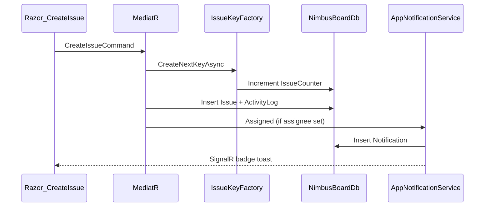
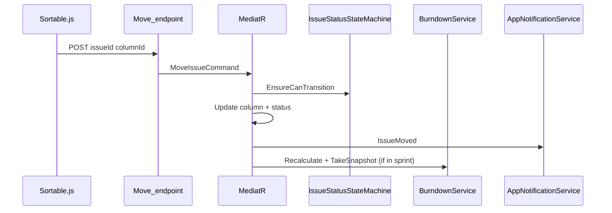
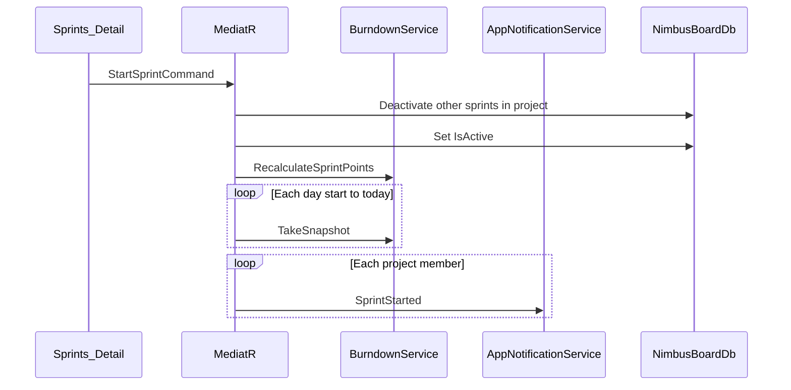
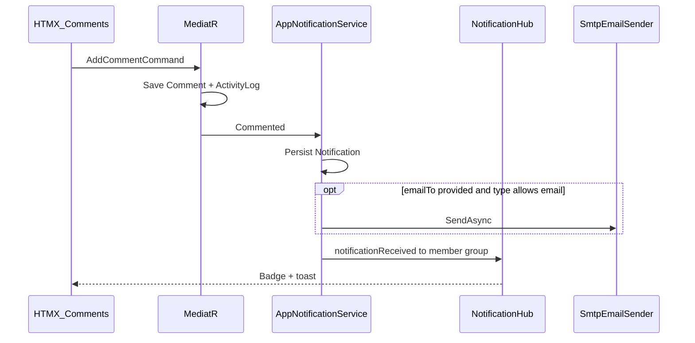
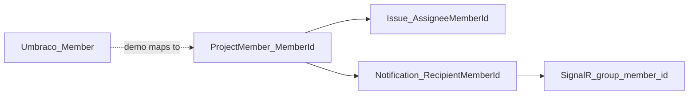

# API / request flows

Primary flows for Nimbus Board. Most mutations go through MediatR handlers; HTMX and SignalR sit at the edges.

## Create issue

## Move issue on board

## Start sprint → burndown

Dashboard / sprint detail then load snapshots via `BurndownQueryHelper` → Chart.js (`burndown-chart.js`).

## Comment → notification → SignalR / email

## Global search (⌘K)

1. Layout modal opens (`search-shortcut.js`)
2. Input `hx-get="/app/search?q=..."` (debounce 200ms)
3. `SearchQuery` matches issues (key/title), projects (key/name), boards (name)
4. Partial `_SearchResults` returns grouped links

## Umbraco member ↔ Nimbus member

In the seeded demo, member `1` (Anjumol Babu) is the active app user for My Work, badge counts, and SignalR group `member:1`. Attachments use Umbraco Media (or local file fallback) via `IAttachmentStorage`.
